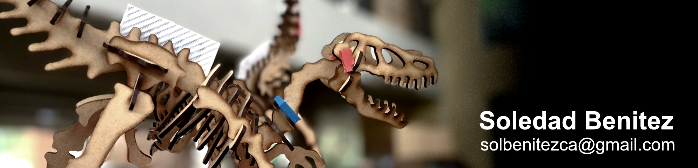

# Affinity: Image editor

## Índice

1. [Introducción](picsart.md#introduccion)
2. [Instalar y abrir Affinity](picsart.md#instalar-y-abrir-affinity)
3. [Crear el documento](picsart.md#crear-el-documento)
4. [Diseñar la portada](picsart.md#disenar-la-portada)
5. [Exportar la imagen](picsart.md#exportar-la-imagen)
6. [Resultado](picsart.md#resultado)

## 1. Introducción 

Para la edición de imagen elegí **Affinity**, un programa de diseño para Mac que permite trabajar con vectores y con fotos en el mismo archivo. Lo usé para diseñar la imagen de portada (header) de la página "Acerca de mí" de esta wiki.

En este video se ve todo el proceso de edición, grabado con OBS:



## 2. Instalar y abrir Affinity 



### Descargar

Affinity se descarga desde [affinity.studio](https://www.affinity.studio/) y se instala arrastrando la aplicación a la carpeta Aplicaciones.



### Abrir

Al abrirlo aparece la pantalla de inicio, desde donde se crea un documento nuevo o se abre uno existente.



## 3. Crear el documento 



### Nuevo documento

Ir a **File → New** (Cmd + N).



### Definir el tamaño

Gitbook recomienda que las portadas midan **1990 × 480 px**, así que configuré el documento con esas medidas, en píxeles.




Gitbook recorta la portada según el ancho de la pantalla. Conviene dejar lo importante en el centro y no poner texto cerca de los bordes.



📸 Captura pendiente: ventana de "New document" con las medidas.


## 4. Diseñar la portada 



### Dibujar el fondo

Con la herramienta de rectángulo, dibujar una forma que cubra todo el lienzo.



### Aplicar un degradado

1. Seleccionar el rectángulo.
2. Presionar **G** para activar la herramienta de relleno (Fill Tool).
3. Hacer clic y arrastrar sobre la forma. El arrastre define la dirección y el largo del degradado.
4. Hacer clic en cada extremo de la línea y elegir su color en el panel de color.



### Ajustar

Haciendo clic sobre la línea se agregan más colores. En la barra superior se cambia el tipo de degradado: lineal, radial, elíptico o cónico.



### Agregar los demás elementos

Sobre el fondo coloqué el resto de los elementos de la portada.




📸 Captura pendiente: el lienzo con el degradado y la herramienta de relleno activa.


## 5. Exportar la imagen 



### Exportar

Ir a **File → Export**, elegir el formato **JPEG** y guardar.



### Subir a Gitbook

En Gitbook, abrir la página, hacer clic en **Add cover** arriba del título y subir la imagen.



## 6. Resultado 

Esta es la imagen final, que funciona como header de mi wiki:

<figure><figcaption>
Portada editada en Affinity
</figcaption></figure>
